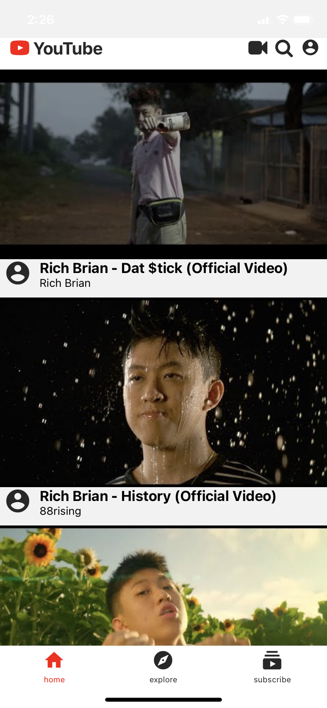
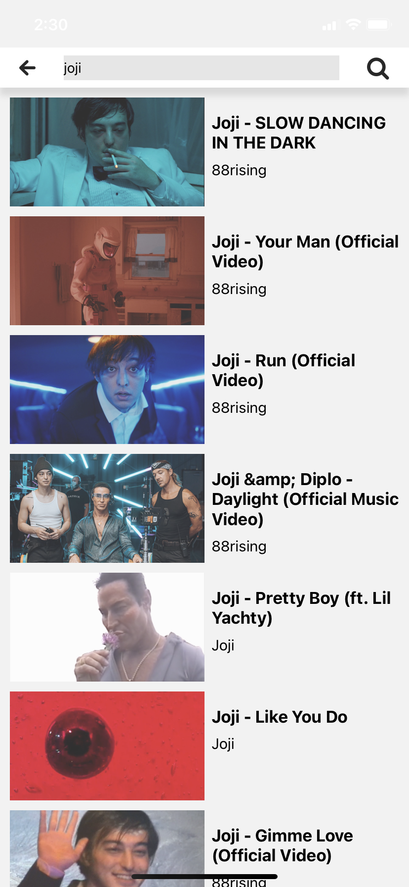
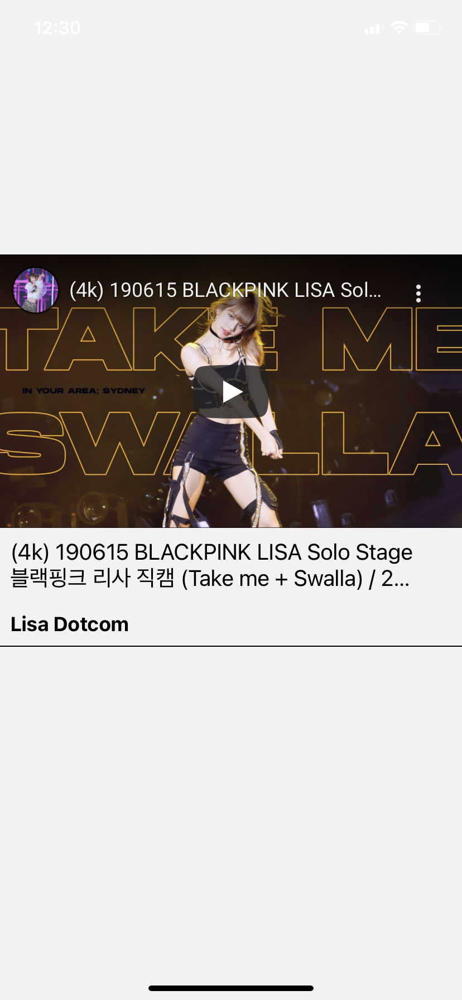
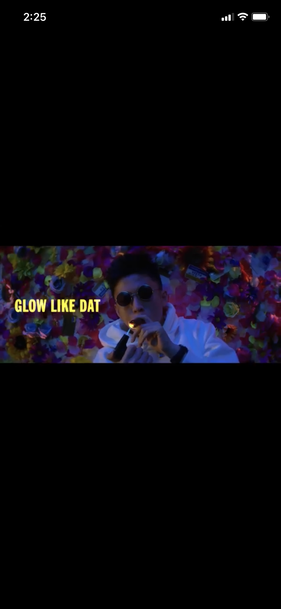
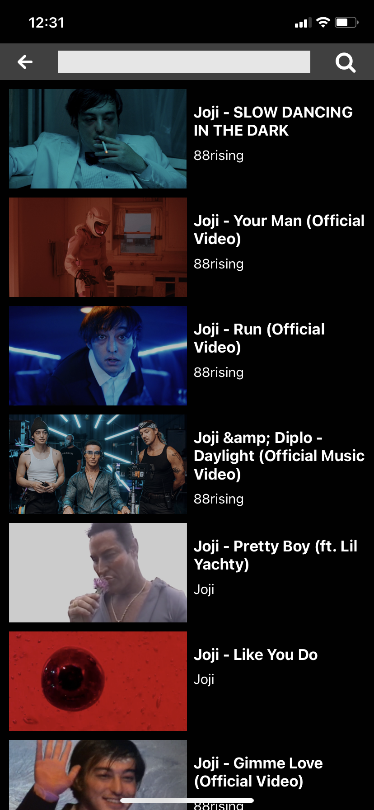
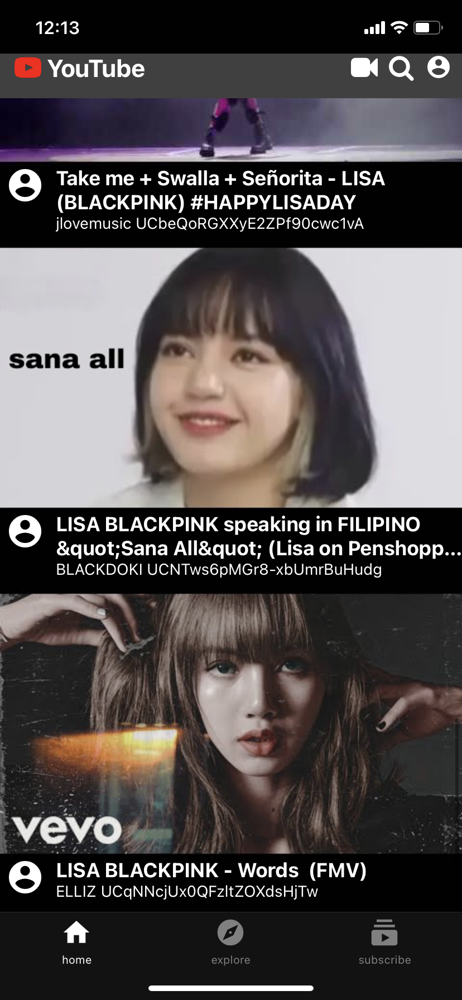
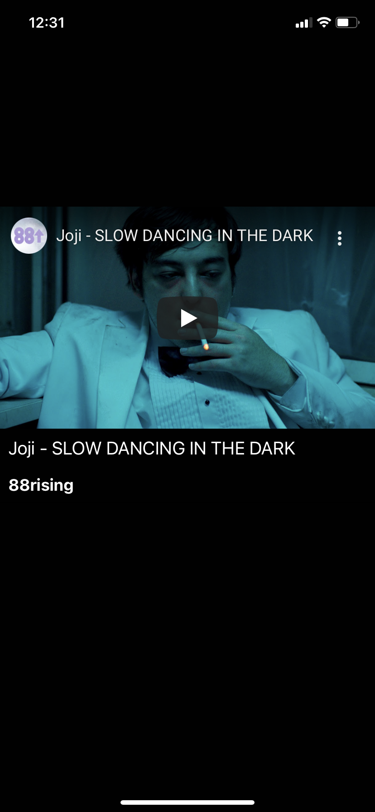

# youtube-clone

**Intro:**

a mobile application that allows user to make clone of youtube app using youtube api. includes how to add dark mode, toggle button to toggle theme, redux. Using React Native, including use of react navigation, vector-icon, react native paper,etc


**Installation guide: (MacOS)**
```
npm install --global expo-cli
```
at Terminal
- go to the server folder(backend)
```
nodemon app
```
- go to the amployeeapp
```
npm install
npm start
```
For ios or android emulator
```
    expo start --android
    expo start --ios
```

**Some ScreenShot:**

Main Page



Search videos



Play video




Dark Mode



